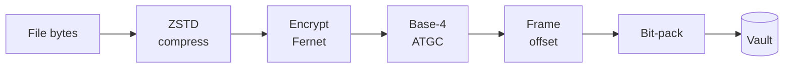

<div align="center">

# 🧬 BioVault

**One file. Six keys. Six different answers.**

A DNA-inspired multi-layer file format — the same vault yields completely
different content depending on which reading key you open it with.

[](https://www.python.org/)
[](LICENSE)
[](SPEC.md)
[](#authenticity)
[](#status)

</div>

---

## The idea

DNA stores different proteins in the same strand depending on where you start
reading and which direction you read it. BioVault does that with files.

Pack up to six files into one vault. Each is addressed by a **reading key** —
three forward frames (`A0`, `A1`, `A2`) and three antisense frames (`B0`, `B1`,
`B2`) — and each carries its own independent password.

```
                    ┌─────────────────┐
   board_notes.txt ─┤                 ├─ A0 ─→ Q4 revenue: 2.4M
      team_memo.txt ┤  company.bvault ├─ A1 ─→ Offsite is on the 14th
    credentials.env ┤                 ├─ B0 ─→ api_key=sk-live-4f9a2b
                    └─────────────────┘
                         one file
```

## Install

```bash
git clone https://github.com/whoami-harshal/biovault.git
cd biovault
pip install -e .
```

Python 3.9+. Dependencies: `cryptography`, `zstandard`.

## See it work

```bash
python examples/demo.py
```

One command. It builds a vault from three files, opens each with a different
key, shows what an attacker sees without a password, and proves that a wrong
password and a tampered file both recover nothing.

## Using the CLI

**Pack three files into one vault** — two encrypted with separate passwords,
one left plain:

```bash
biovault encode --input "board.txt:A0" "memo.txt:A1" "creds.env:B0" --prompt-password --output company.bvault
```

```
  Layer A0 queued: board.txt (37 bytes) [🔐 encrypted]
  Layer A1 queued: memo.txt (25 bytes) [plain]
  Layer B0 queued: creds.env (24 bytes) [🔐 encrypted]

🧬 Building BioVault v4: company.bvault
✅ BioVault created: company.bvault
   Keys: ['A0', 'A1', 'B0']
```

**Open one layer:**

```bash
biovault decode --input company.bvault --key A0 --output board.txt
```

```
🔓 Extracting layer A0...
  ✅ Authenticated on decrypt (HMAC-SHA256)

Q4 revenue: 2.4M
Runway: 18 months
```

**Same file, different key, different content:**

```bash
biovault decode --input company.bvault --key B0 --output creds.env
```

```
api_key=sk-live-4f9a2b
```

**See what's inside without any password:**

```bash
biovault info --input company.bvault
```

## Authenticity

Sign a vault so anyone can prove it came from you and hasn't been altered.

**Create a signing key** (once):

```bash
biovault keygen --output mykey
```

```
✅ Signing key created
   Private key: mykey       (keep this secret)
   Public key:  mykey.pub   (share this)
   Fingerprint: 29a9:8f3f:682f:d845
```

**Sign a vault as you build it:**

```bash
biovault encode --input "release.tar:A0" --sign mykey --output release.bvault
```

**Anyone verifies with your public key** — no secret required:

```bash
biovault verify --input release.bvault --key mykey.pub
```

```
✅ Signature valid — signed by 29a9:8f3f:682f:d845
   This vault has not been modified since it was signed.
```

Modify a single byte and re-checksum it, and verification fails. Re-sign it
with a *different* key and the fingerprint no longer matches yours. You can
also require a valid signature during extraction:

```bash
biovault decode --input release.bvault --key A0 --verify mykey.pub --output out.tar
```

## Prove it yourself

Delete the originals, then try to get them back. Every layer is independent:

```bash
biovault decode --input company.bvault --key B0 --password "boardpass" --output out.env
```

```
  ⚠️  Wrong password — nothing recovered
```

`boardpass` is the *correct* password — for layer `A0`. Against `B0` it is
worthless, and no partial file is written. Each layer derives its own key from
its own password and its own random salt.

And the vault holds no readable plaintext:

```bash
grep -i "api_key" company.bvault      # findstr /i "api_key" on Windows
```

Returns nothing.

## Reading keys

| Key | Strand | Frame | Reads |
|-----|--------|-------|-------|
| `A0` `A1` `A2` | Forward (sense) | 0, 1, 2 | Left to right |
| `B0` `B1` `B2` | Reverse (antisense) | 0, 1, 2 | Reverse complement |

Six keys, six layers, one per vault — the same number of reading frames a real
double-stranded sequence has.

Reading keys are **addresses, not credentials.** All six are public and
enumerable. Confidentiality comes from the per-layer password, not the key.

## How it works

Each layer runs an independent pipeline:



1. **Compress** — ZSTD level 9
2. **Encrypt** — Fernet (AES-128-CBC + HMAC-SHA256), scrypt-derived key, random salt per layer
3. **Base-4 encode** — every 2 bits becomes a nucleotide: `A=00 T=01 G=10 C=11`
4. **Frame offset** — the reading key sets the strand and offset
5. **Bit-pack** — four symbols per byte, so the DNA representation costs nothing

Decoding runs it backwards. Full details in [SPEC.md](SPEC.md).

## Security

**What holds:**

- Encrypted layers use **authenticated** encryption — a tampered layer fails to decrypt rather than returning corrupted bytes
- **scrypt** key derivation (n=2¹⁵, ~32 MiB per guess) resists GPU and ASIC cracking
- Independent random salt per layer, so the same password on two layers still produces different keys
- **Ed25519 signatures** authenticate the entire container, including unencrypted layers and all metadata
- A wrong password produces **no output and no partial file**
- Untrusted vaults are handled defensively: metadata is validated, decompression is capped, and output paths are never read from the file

**What does not hold — read this before trusting it with anything:**

- **This is not a hidden-volume system.** A vault openly states how many layers it holds and which are encrypted; `biovault info` prints exactly that. It protects the *contents* of your data, not the *fact that it exists*. Don't rely on it for plausible deniability.
- **Unsigned vaults are not tamper-proof.** Without `--sign`, the container is protected only by a plain SHA-256 checksum, which anyone can recompute after editing. Sign anything you distribute.
- **Ciphertext length leaks a little.** Layers are compressed before encryption, so stored size correlates with how compressible the plaintext was.

Keep passwords off the command line:

```bash
echo "$PASSWORD" | biovault decode --input vault.bvault --key A0 --password-stdin --output out.txt
```

## Performance

The DNA model is free. Packing base-4 symbols back into bytes is the exact
inverse of unpacking them, so the whole ATGC round trip reduces to a bit shift
and a table lookup — `biovault/transform.py` does it on bytes, and
`test_fast_path_matches_reference` proves it matches the readable
`frames.py` + `packer.py` implementation byte for byte across all six modes.

| File | Encode | Decode |
|------|--------|--------|
| 1 MB | 0.02s | 0.05s |
| 20 MB | 0.24s | 0.26s |
| 100 MB | 1.53s | 1.67s |

A signed 6.8 MB release tarball round-trips in under a second. The earlier
character-by-character implementation took roughly 3.5 seconds per megabyte,
which put a 100 MB artifact at six minutes.

Memory is still proportional to file size — the whole vault is held in RAM.
Layers decompress to at most 256 MiB by default; raise it deliberately when
you need to:

```bash
biovault decode --input big.bvault --key A0 --max-decompressed 2G --output out.tar
```

## Use cases

**Staged release without infrastructure.** Publish the vault today; release the
password later. No server, no auth system, no backend — you control timing by
controlling one string. CTF challenges, embargoed press releases, exam papers
distributed in advance. Sign it and recipients can confirm it's authentic the
moment they receive it, long before they can open it.

**One artifact, tiered access by role.** Ship a single file to the whole team.
Ops opens `B0` and gets credentials; the board opens `A0` and gets financials;
everyone opens `A1` and gets the memo. No key management server, and one leaked
password exposes one layer rather than everything.

**Signed distribution.** Publish a vault anywhere — a CDN, a torrent, a git
repo — and recipients verify authorship with your public key alone. Tampering
in transit is detectable without any shared secret, and a 100 MB artifact
signs and verifies in under two seconds.

**CTF and puzzle design.** Six keys, three on the reverse strand, wrong
passwords revealing nothing. `A0` through `B2` is a built-in puzzle mechanic,
and layered password releases make multi-stage challenges straightforward.

**Compartmentalized field notes.** Research or reporting material where a
compromised password exposes one compartment instead of the whole archive.

**A teaching artifact.** The v2→v4 history is a complete worked example of
finding and fixing real vulnerabilities — path traversal, decompression bombs,
plaintext-confirmation — with working exploits and regression tests for each.

## Security audit

v3 followed a full review of v2. Five real vulnerabilities were found and
fixed, each with a working proof-of-concept and a regression test:

| Severity | Issue | Fix |
|----------|-------|-----|
| **Critical** | Arbitrary file write — vault metadata chose the output path, so a crafted vault could write to `~/.ssh/authorized_keys` | Output paths are generated locally, never read from the file |
| **Critical** | Encrypted layers stored a SHA-256 of their **plaintext** in cleartext metadata, letting anyone confirm a guessed plaintext without the password | Removed for encrypted layers; Fernet's HMAC already authenticates them |
| **High** | Integrity failures printed a warning, then wrote the file anyway | Raises and writes nothing |
| **High** | Decompression bombs — 1.6 KB expanded to 50 MB unchecked | Streaming decompression with a hard output cap |
| **Medium** | PBKDF2 at 100k iterations, below the OWASP floor | Switched to scrypt (memory-hard) |

v4 closed the last finding — an unkeyed container checksum — with Ed25519
signing, and fixed a packing bug that made every vault exactly twice the size
it needed to be.

Plus: 64-bit truncated checksums replaced with full SHA-256, metadata
validation on untrusted input, secure password entry, and corrected docs — v2
advertised "AES-256" when Fernet is AES-128, and claimed a plausible
deniability the format never provided.

```bash
python tests/test_core.py
```

Fifteen tests, nine of which replay the original exploits or verify signing.

## Roadmap

- [x] ~~Halve vault size~~ — packer now stores 4 symbols per byte (v4)
- [x] ~~Authenticate the whole container~~ — Ed25519 signing (v4)
- [x] ~~Make the pipeline fast enough for real artifacts~~ — byte-level transform, ~140x faster (v4)
- [ ] **Streaming pipeline** — speed is solved, but memory is still proportional to file size
- [ ] **Deniable mode** — fixed-size, random-filled containers where layer count is genuinely unknowable
- [ ] CI, pytest runner, type hints

## Status

**Experimental.** A research and portfolio project, not independently audited.
The cryptographic primitives are standard and correctly used, but the format
itself is young. Don't protect anything irreplaceable with it yet.

## License

MIT © 2026 Harshal
